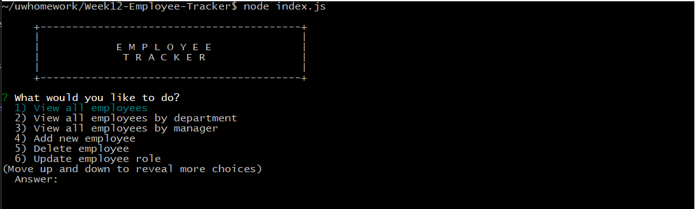
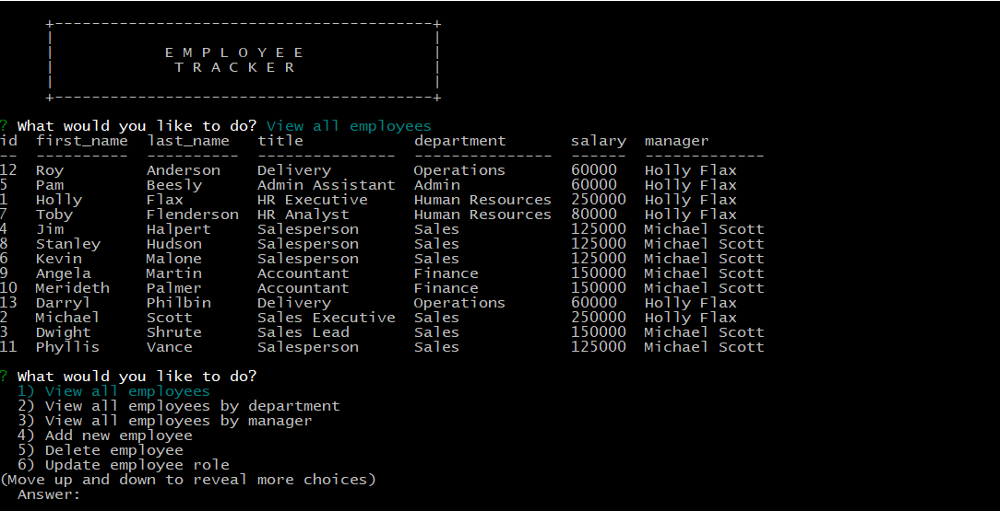

# Week12-Employee-Tracker

## Description

- This is a command line interface "Employee Tracker" that manages Employees, Departments and Roles via a MySQL database.
- The interface presents the user with the various different views, the ability to update, add, and delete via menus.

## Viewing Options

- View all employees
- View all employees by department
- View all employees by manager
- View all departments
- View all roles

## Updating Options

- Update employee role
- Update employee manager

## Add and Delete options

- Add new employee
- Add new department 
- Add new role
- Delete employee

## Usage

- Application can be run via Node using the command "node index.js".

## Screenprints 
 

---
